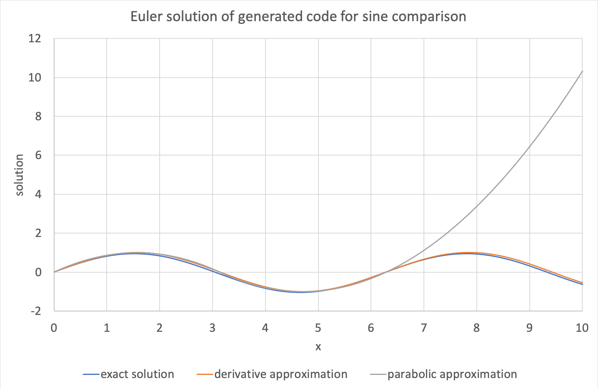

.. _users_solver:

Simulation tool developer: Solver
=================================
The code generation functionality in libCellML can be used to transform CellML models into procedural code for simulation.
This example works through that process. 

**Contents**

.. contents::
   :local:

| **C++ resources**
|    ├ :download:`CMakeLists.txt<../code/example_solveGeneratedModel_CMakeLists.txt>`
|    ├ :download:`example_solveGeneratedModel.cpp<../code/example_solveGeneratedModel.cpp>`
|    └ resources/
|        ├ :download:`sineComparisonExample.c<../code/generated_code/sineComparisonExample.c>`
|        └ :download:`sineComparisonExample.h<../code/generated_code/sineComparisonExample.h>`

| **Python resources**
|    ├ :download:`example_solveGeneratedModel.py<../code/example_solveGeneratedModel.py>`
|    └ resources/
|        └ :download:`sineComparisonExample.py<../code/generated_code/sineComparisonExample.py>`

Create a placeholder for the solver
-----------------------------------
Interacting with procedural code means that we need a program, so the first step is to create what will soon become our solver.
To start with, the program only reads and interprets command line arguments; the size and number of timesteps to simulate.
This is done using a simple function, as below.

.. tabs::

    .. tab:: C++ 

      .. literalinclude:: ../code/example_solveGeneratedModel.cpp
        :language: c++
        :start-after: // COMMAND LINE FUNCTION
        :end-before: // END COMMAND LINE FUNCTION

    .. tab:: Python 

      .. literalinclude:: ../code/example_solveGeneratedModel.py
        :language: python
        :start-after: # MODULE FROM FILE
        :end-before: # END MODULE FROM FILE

Once the function exists, we can call it from the main function to process the command line arguments.

.. tabs::

    .. tab:: C++ 

      .. literalinclude:: ../code/example_solveGeneratedModel.cpp
        :language: c++
        :start-after: // STEP 0 
        :end-before: // STEP 1 

    .. tab:: Python 

      .. literalinclude:: ../code/example_solveGeneratedModel.py
        :language: python
        :start-after: # STEP 0
        :end-before: # STEP 1

Connect with the generated code
-------------------------------
The profile language will affect how you need to interact with the generated code.

For Python, the generated code must be converted into a module, and then imported.
This is shown in the example code below.  

For C it's a little more complicated, as you will need to compile the solver whilst including the generated interface :code:`*.h` file and linking to the implementation :code:`*.c` file.
A CMake file is provided which will do this for you.
The build process needs to know the name of the implementation file containing the generated code, so this is given as the :code:`-DINPUT=yourBaseFileName` argument (without extension).
This file and the corresponding interface :code:`.h` file are copied by CMake to two files named :code:`modelToSolve.cpp` and :code:`modelToSolve.h` respectively.
This step is required so that within the solver code we can :code:`#include` a known file name.

.. tabs::

    .. tab:: C building and linking

        Navigate into the folder containing the generated code :code:`sineComparisonExample.[c,h]` as well as the :code:` example_solveGeneratedModel.cpp` source code from above.

        .. code-block:: terminal
        
            cmake -DINPUT=sineComparisonExample .

        You should see an output similar to this:

        .. code-block:: terminal

            -- The C compiler identification is AppleClang 10.0.1.10010046
            -- The CXX compiler identification is AppleClang 10.0.1.10010046
            -- Check for working C compiler: /Library/Developer/CommandLineTools/usr/bin/cc
            -- Check for working C compiler: /Library/Developer/CommandLineTools/usr/bin/cc -- works
            -- Detecting C compiler ABI info
            -- Detecting C compiler ABI info - done
            -- Detecting C compile features
            -- Detecting C compile features - done
            -- Check for working CXX compiler: /Library/Developer/CommandLineTools/usr/bin/c++
            -- Check for working CXX compiler: /Library/Developer/CommandLineTools/usr/bin/c++ -- works
            -- Detecting CXX compiler ABI info
            -- Detecting CXX compiler ABI info - done
            -- Detecting CXX compile features
            -- Detecting CXX compile features - done

            1) First use 'make -j' to build the executable
            2) Then solve by running: ./solve_sineComparisonExample with the arguments:
            -n  step_total
            -dt step_size

            -- Configuring done
            -- Generating done
            -- Build files have been written to: your/file/location/here

        Note that the combined program is now available with the prefix :code:`solve_` before the base file name you provided with the :code:`-DINPUT` argument, and can be run using the instructions given in the printout above.

    .. tab:: Python 

      .. literalinclude:: ../code/example_solveGeneratedModel.py
        :language: python
        :start-after: # MODULE FROM FILE
        :end-before: # END MODULE FROM FILE

Retrieve the generated model information
----------------------------------------
The generated code contains model information in dictionaries, as well as functions to interface with the model's mathematics.
These are:

- :code:`VOI_INFO`: a dictionary with the :code:`.name`, :code:`.units`, and :code:`.component` attributes related to the variable of integration,
- :code:`STATE_INFO`: a list of similar information for the state variables,
- :code:`VARIABLE_INFO`: a list of similar information for the non-state variables. 

.. tabs::

    .. tab:: C++ 

      .. literalinclude:: ../code/example_solveGeneratedModel.cpp
        :language: c++
        :start-after: // STEP 1
        :end-before: // STEP 2

    .. tab:: Python 

      .. literalinclude:: ../code/example_solveGeneratedModel.py
        :language: python
        :start-after: # STEP 1
        :end-before: # STEP 2

Allocate space for the solution
-------------------------------
Also within the generated code are functions to allocate space for the variables:

- create states array: to construct arrays for storage of the state variables and their rates;
- create variables array: to construct an array to store the other variables.

.. tabs::

    .. tab:: C++ 

      .. literalinclude:: ../code/example_solveGeneratedModel.cpp
        :language: c++
        :start-after: // STEP 2
        :end-before: // STEP 3

    .. tab:: Python 

      .. literalinclude:: ../code/example_solveGeneratedModel.py
        :language: python
        :start-after: # STEP 2
        :end-before: # STEP 3

Retrieve the model's mathematical formulation
---------------------------------------------
The mathematical equations that govern the model's behaviour can be applied using functions from within the generated code:

- initialise states and constants: does what it says, sets all the initial value attributes;
- compute computed constants: computes the value of any constants which depend on others;
- compute variables: calculates those variables whose values depend on the state variables; and
- compute rates: calculates the rates of change of the state variables.

Note that all model variables which affect the rates' values (and thereby affect the states' values) are updated in the *compute rates* function.
This means that you only need to call the *compute variables* function when you're saving the output from a step; it does not need to be called for intermediate timesteps.

Before we begin iterating, the values of all variables are calculated.

.. tabs::

    .. tab:: C++ 

      .. literalinclude:: ../code/example_solveGeneratedModel.cpp
        :language: c++
        :start-after: // STEP 3
        :end-before: // STEP 4

    .. tab:: Python 

      .. literalinclude:: ../code/example_solveGeneratedModel.py
        :language: python
        :start-after: # STEP 3
        :end-before: # STEP 4

Prepare a file for the solution output
--------------------------------------
If you have an alternative way to save your solution, you can skip this step.
Here we create a simple text-delimited file into which the solution can be written at each timestep.

.. tabs::

    .. tab:: C++ 

      .. literalinclude:: ../code/example_solveGeneratedModel.cpp
        :language: c++
        :start-after: // STEP 4
        :end-before: // STEP 5

    .. tab:: Python 

      .. literalinclude:: ../code/example_solveGeneratedModel.py
        :language: python
        :start-after: # STEP 4
        :end-before: # STEP 5

Perform the integration steps
-----------------------------
Finally we iterate through the timesteps, calculating the state variables, and updating the rates each step.
The solution values and calculated variables are written to the output file.

.. tabs::

    .. tab:: C++ 

      .. literalinclude:: ../code/example_solveGeneratedModel.cpp
        :language: c++
        :start-after: // STEP 5
        :end-before: // END

    .. tab:: Python 

      .. literalinclude:: ../code/example_solveGeneratedModel.py
        :language: python
        :start-after: # STEP 5
        :end-before: # END

The solution files are written in a tab-delimited format which can be read by your favourite plotting application.
The plots below were generated using a step size of 0.1 for 100 iterations.

   Plots generated from an Euler solution to the sine comparison model for a step size of 0.1.
